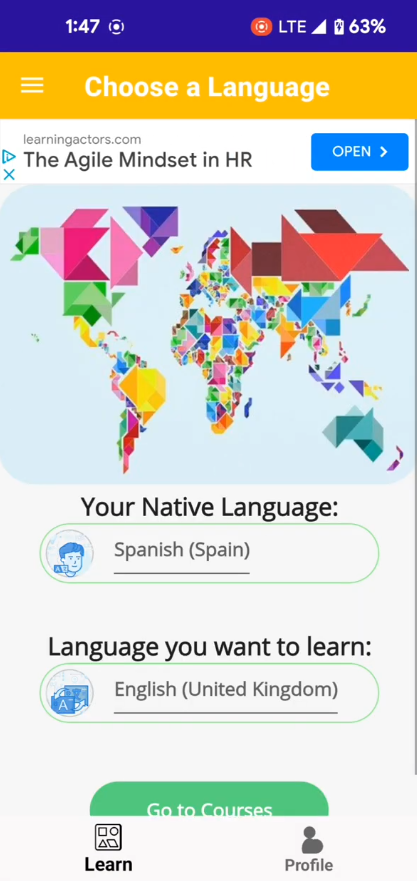
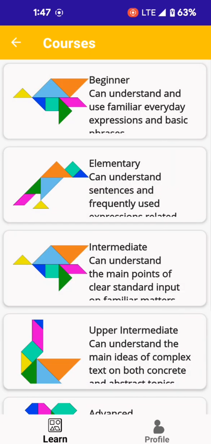
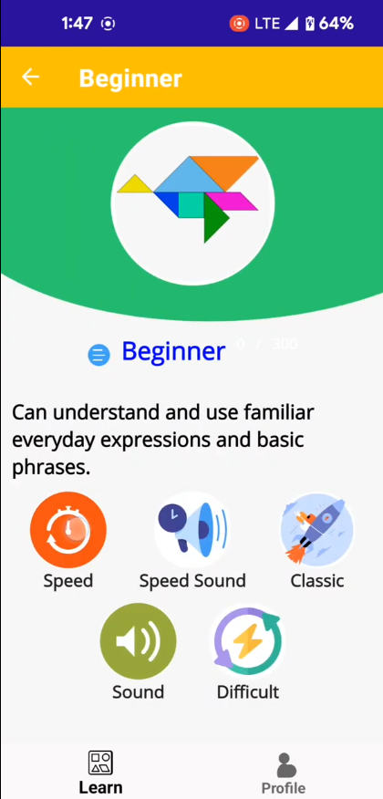
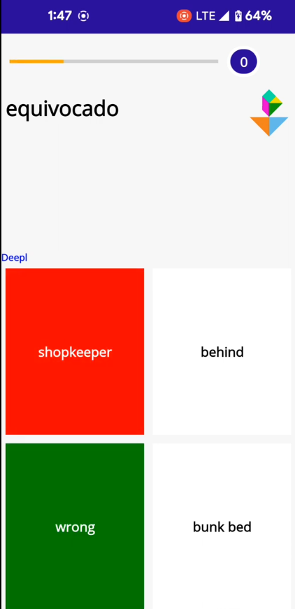
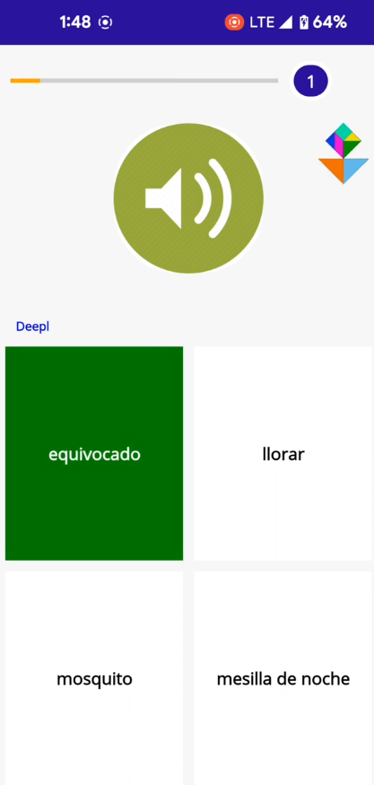
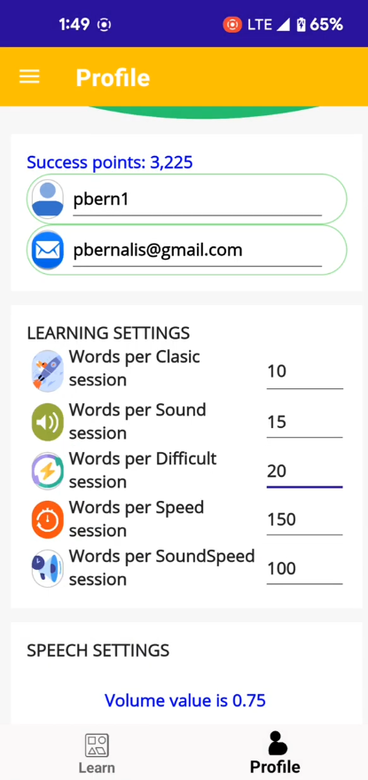

[Return to Panagiotis Bernalis' GitHub Profile for more innovative projects](https://github.com/pbernalis)

# Language Learning Mobile Application


This project is a mobile application designed to help users learn new languages by learning vocabulary with flashcards and other interactive methods. The application is built using .NET Core 8 for the backend API and .NET MAUI for the cross-platform mobile application targeting Android devices.


## Features

- User authentication and authorization
- Flashcard-based vocabulary learning
- Support for multiple languages
- Score tracking and progress monitoring
- Interactive and user-friendly interface

## Technologies Used

- **Backend API**: .NET Core 8, Entity Framework Core
- **Database**: Code-First approach with SQL Server
- **Mobile Application**: .NET MAUI
- **Authentication**: ASP.NET Core Identity
- **Serialization**: System.Text.Json
- **HTTP Client**: System.Net.Http


## Project Structure

- **Humanigram.APIToken**: This is the backend API project.
  - Implements authentication and user management
  - Provides endpoints for managing language vocabulary and user progress

- **HumanigramApp**: This is the mobile application project.
  - Provides a user interface for learning new vocabulary
  - Uses .NET MAUI to target Android devices
  - Interacts with the backend API to fetch and display data


## Database Migrations

The following migrations have been implemented for the backend API:

```csharp
namespace Humanigram.APIToken.Migrations
{
    public partial class p1 : Migration
    {
        protected override void Up(MigrationBuilder migrationBuilder)
        {
            // Migration code
        }

        protected override void Down(MigrationBuilder migrationBuilder)
        {
            // Rollback code
        }
    }
}
```

## Mobile Application
The mobile application is built using .NET MAUI and provides the following functionalities:

- Displays vocabulary flashcards
- Allows users to interact with flashcards and track their scores
- Fetches data from the backend API

## Screenshots
### Start Screen

The start screen of the language learning app features a vibrant and engaging design with a geometric logo at the center. The screen's background is a calming purple color. This is the initial interface users encounter upon launching the app, setting the tone for a modern and user-friendly experience.


### Language Selection Screen

The language selection screen of the language learning app enables users to specify their native language and the language they wish to learn. The screen features a colorful world map composed of geometric shapes, symbolizing global language diversity. Below the map, users can select their native language and target language from drop-down menus. Once the languages are chosen, users can proceed to courses by tapping the "Go to Courses" button. This intuitive interface simplifies the initial setup process, ensuring a personalized and effective learning experience.



### Courses Selection Screen

The courses selection screen of the language learning app allows users to choose from various proficiency levels, each tailored to specific learning needs. The available levels include Beginner, Elementary, Intermediate, Upper Intermediate, and Advanced. Each level is accompanied by a colorful geometric icon and a brief description outlining the skills and competencies covered. This organized layout helps users easily navigate and select the appropriate course based on their current proficiency and learning goals.



### Learning Mode Selection Screen
The learning mode selection screen of the language learning app introduces the user to different learning modes available at the beginner level. The screen displays a description of the beginner level, which focuses on understanding and using familiar everyday expressions and basic phrases. Users can choose from various modes such as Speed, Speed Sound, Classic, Sound, and Difficult, each represented by distinct icons. The layout is user-friendly and visually appealing, making it easy for users to select their preferred learning method and start their language acquisition journey.


### Text-Based Learning Session
The text-based learning session screen of the language learning app is designed to test users' vocabulary knowledge by presenting them with a word in the target language at the top. Users must choose the correct translation from the multiple-choice options below. Correct answers are highlighted in green, while incorrect choices are marked in red, providing immediate feedback. The screen also includes a progress bar and level indicator to track the user's advancement. This interactive approach helps reinforce learning through active recall and visual feedback.



### Sound-Based Learning Session

The sound session screen of the language learning app provides an interactive method for users to learn vocabulary through audio prompts. At the top, a progress bar and current level indicator are displayed. The central part of the screen features a prominent speaker icon, indicating the sound-based activity. Below it, users are presented with multiple choice options, where they need to select the correct word based on the audio cue. This engaging layout aids in auditory learning, enhancing the user's ability to recognize and remember new words effectively.



### User Profile and Learning Settings Screen

The profile screen of the language learning app displays the user's account information, including username and email, along with their accumulated success points. The learning settings section allows users to customize their learning experience by setting the number of words per session for various types of learning modes such as Classic, Sound, Difficult, Speed, and SoundSpeed sessions. Additionally, there is a section for adjusting speech settings. The interface is intuitive and neatly organized, facilitating easy personalization for an effective learning journey.



## Links & References
- .NET Core 8 Documentation: Comprehensive guide and documentation for .NET Core 8, including tutorials and API references.

  [Official .NET Core Documentation](https://learn.microsoft.com/en-us/dotnet/fundamentals/)

- .NET MAUI Documentation: Official documentation for .NET Multi-platform App UI (MAUI), including setup guides and API references.
  
  [Official .NET MAUI Documentation](https://learn.microsoft.com/en-us/dotnet/maui/?view=net-maui-8.0)

- Entity Framework Core: Documentation for Entity Framework Core, including tutorials on using Code-First approach with SQL Server.
  
  [Entity Framework Core Documentation](https://learn.microsoft.com/en-us/ef/core/)

- ASP.NET Core Identity: Guide and documentation on implementing authentication and authorization using ASP.NET Core Identity.
  
  [ASP.NET Core Identity Documentation](https://learn.microsoft.com/en-us/aspnet/core/security/authentication/identity?view=aspnetcore-8.0&tabs=visual-studio)

- System.Text.Json: Documentation for the System.Text.Json namespace, which provides high-performance JSON serialization and deserialization.
  
  [System.Text.Json Documentation](https://docs.microsoft.com/en-us/dotnet/api/system.text.json?view=net-8.0)

- System.Net.Http: Documentation for the System.Net.Http namespace, which provides a programming interface for modern HTTP applications.
  
  [System.Net.Http Documentation](https://learn.microsoft.com/en-us/dotnet/api/system.net.http?view=net-8.0)

- Microsoft SQL Server: Comprehensive guide and documentation for Microsoft SQL Server, including setup, configuration, and usage.
  
  [Microsoft SQL Server Documentation](https://learn.microsoft.com/en-us/sql/sql-server/?view=sql-server-ver16)

- YouTube Video: An introductory video showcasing the main features and user interface of the language learning app.
  
  [Watch the Video](https://www.youtube.com/watch?v=kjEgUELkBt0)

## Contact
For any inquiries or access requests, please reach out via [LinkedIn](https://www.linkedin.com/in/pbernalis/).

## License

This project is licensed under the terms specified in this document. For more information, see the [LICENSE](https://github.com/pbernalis/pbernalis/blob/main/blob/main/License.md) file.
